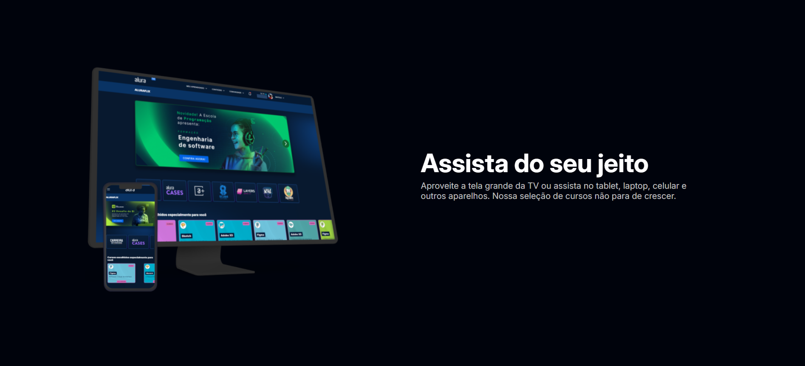
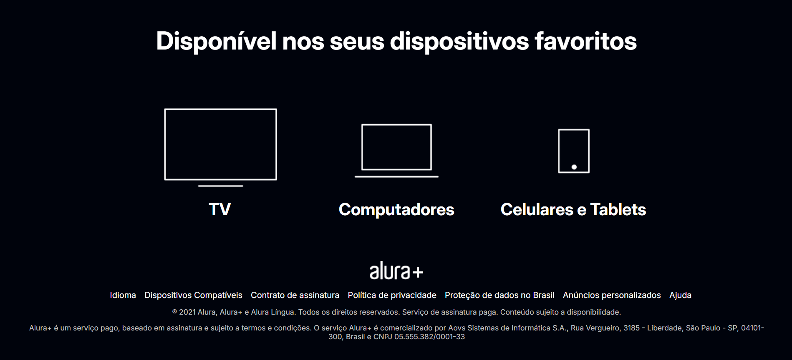

# 🖥️ Alura+
[Translate to English](https://github.com/sthefanyalaminos/aluraplus/blob/main/READEME_EN.md)

Projeto desenvolvido durante o curso HTML e CSS: praticando HTML/CSS da Alura, com foco na construção de interfaces modernas e responsivas a partir de um design pré-definido no Figma.

<a href="https://sthefanyalaminos-aluraplus.vercel.app/">Clique aqui para acessar!</a>

---
O Alura Plus é uma landing page que simula a apresentação de uma plataforma de streaming educacional, destacando planos, benefícios e funcionalidades do serviço.

O desenvolvimento foi realizado seguindo o fluxo de trabalho de um desenvolvedor front-end, transformando um layout do Figma em uma aplicação web funcional, com atenção à fidelidade visual, responsividade e boas práticas de HTML e CSS.

## Tecnologias Utilizadas
- HTML5;
- CSS3 com Flexbox e Grid.

## Funcionalidades
- Estruturação semântica de páginas HTML;
- Organização de layout com Flexbox e Grid;
- Seções estruturadas para apresentação de conteúdo;
- Botões e chamadas para ação (CTA);
- Estilização baseada em design do Figma.

## Design
O layout do projeto foi disponibilizado via Figma pela Alura, e a implementação buscou manter fidelidade ao design original, incluindo:

- Tipografia;
- Espaçamentos;
- Cores;
- Componentes visuais.

## Autoria
Desenvolvido por Sthefany Alaminos.
